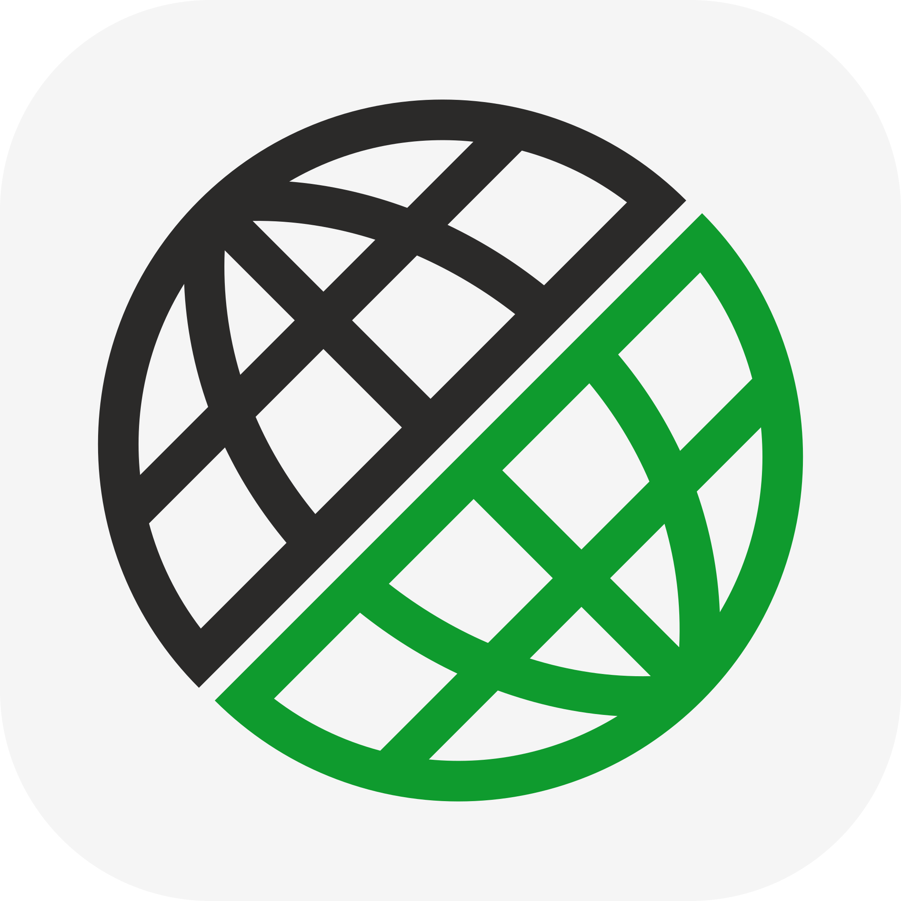
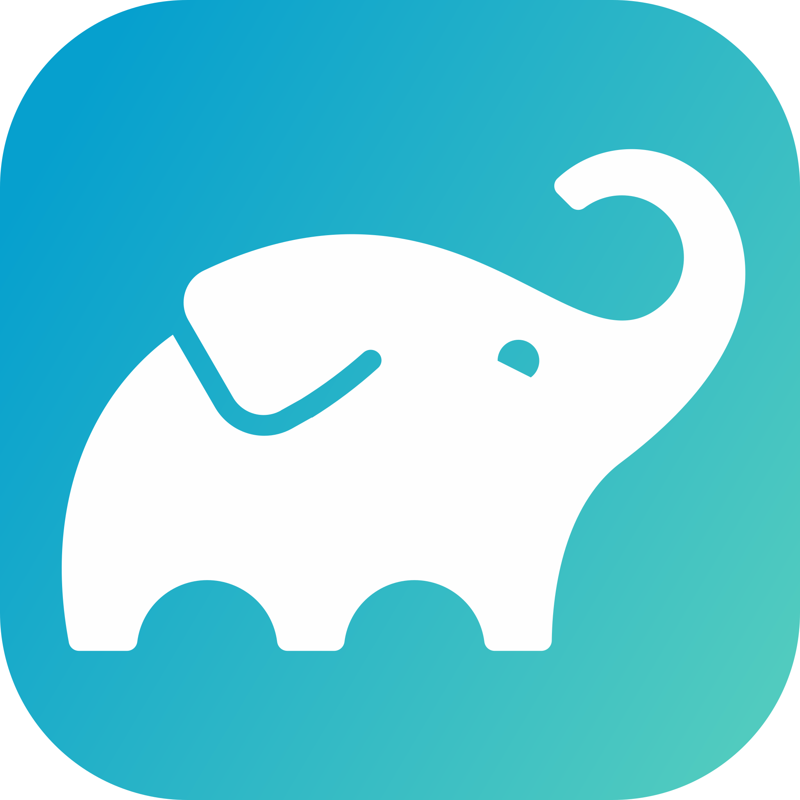
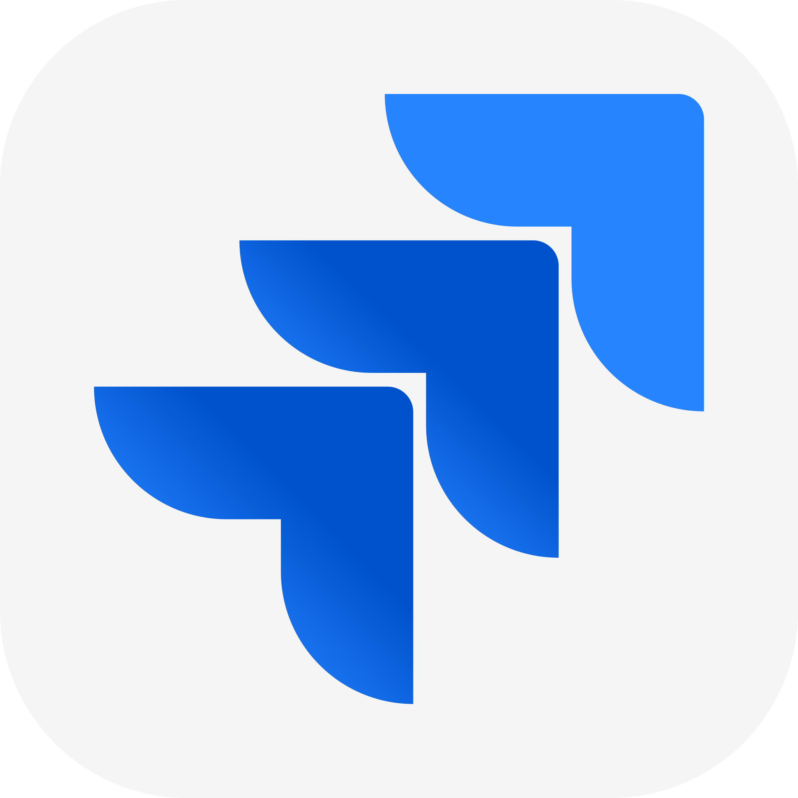
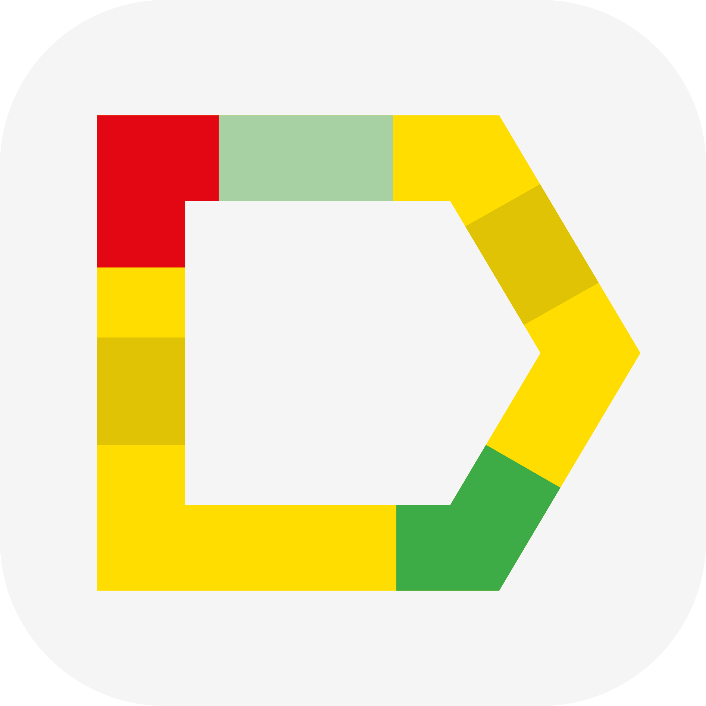
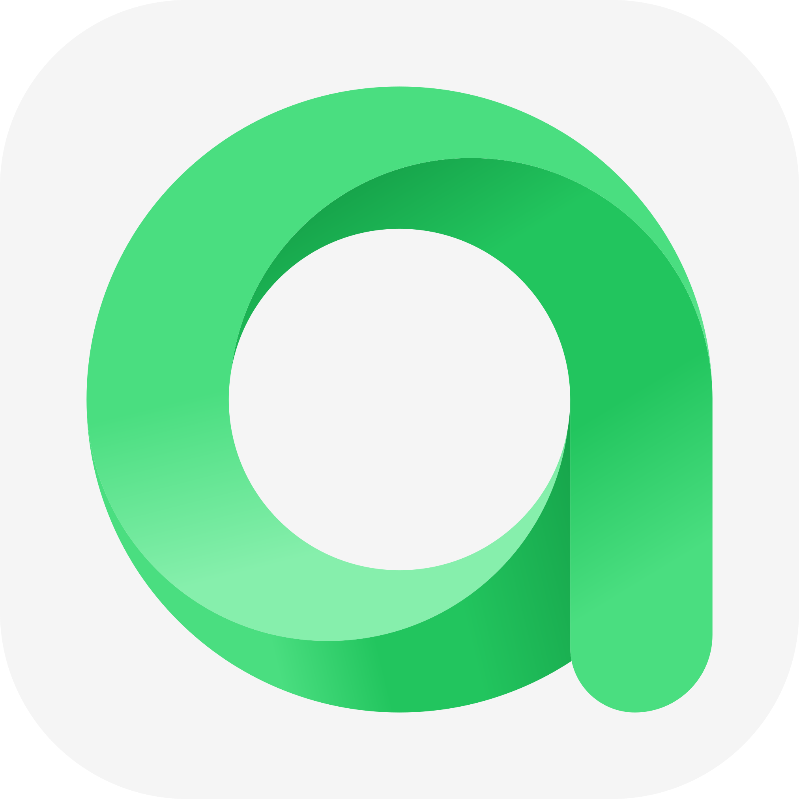

## Welcome to my GitHub page! 👋

## About Me
ISTQB Certified Full Stack QA Engineer with over 4 years of hands-on experience in manual testing of web and mobile apps for fintech, biotech and telecom companies. Led a team of 7 testers for one year. Expanding skills in automation testing for UI and API using
Java (Gradle, Selenide, JUnit5) and performance testing with JMeter5.

**Technical Skills**
+ **Test Automation:** Java, Selenide, Gradle, JUnit5, REST-assured, Jenkins, Selenoid, Allure
+ **Load Testing:** JMeter5, Lighthouse in Chrome DevTools
+ **Manual Web Testing:** REST API via Postman, Swagger, SQL-queries in MySQL (select, group by, having, join, insert, update, delete), DevTools, logs in WinSCP and Putty, Amazon ECS, Bash (basic level, including grep and ssh), Figma designs, bugs in Jira,
test cases in TestRail, Xray, Adaptavist
+ **English:** B2 Upper intermediate

## Stack

## My Projects
| Course                                             | Repository                                                                                                                                                                                                                                                                                                                                                                                                                                                      | Certificate                                                          |
|----------------------------------------------------|-----------------------------------------------------------------------------------------------------------------------------------------------------------------------------------------------------------------------------------------------------------------------------------------------------------------------------------------------------------------------------------------------------------------------------------------------------------------|----------------------------------------------------------------------| 
| [QA GURU Test Automation School](https://qa.guru/) |   ||

## Stats

## Contact
alansinatalya@gmail.com

## CV
+ [CV](https://drive.google.com/file/d/1HR7i-pIcxE6msbOZ-n6FcvsKFU30DcRI/view?usp=drive_link)
+ [Резюме](https://drive.google.com/file/d/1Dxu-kpQFeYfp4L4G-EsmpE9m_iKX4Lv2/view?usp=drive_link)
<!--
**natalyaalansi/natalyaalansi** is a ✨ _special_ ✨ repository because its `README.md` (this file) appears on your GitHub profile.

